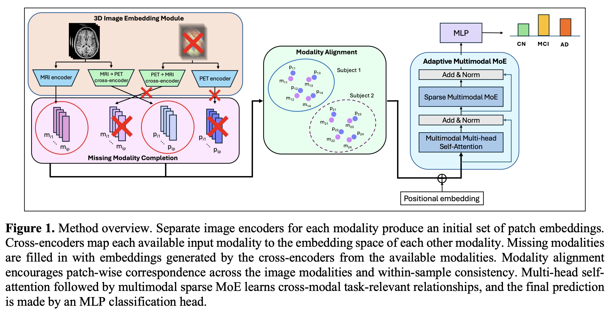
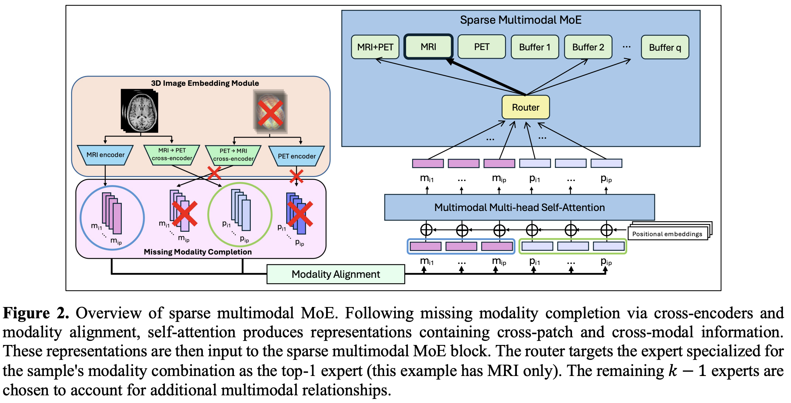

# V3D-MMoE: Adaptive Integration of Incomplete Multimodal 3D Neuroimaging for Alzheimer’s Prediction and Biomarker Discovery

## Overview

Alzheimer’s disease (AD) diagnosis requires analysis of diverse data types to capture the heterogeneous factors underlying its development and progression. Magnetic resonance imaging (MRI) and positron emission tomography (PET) noninvasively measure brain structure and neuronal activity, respectively, and can serve as early indicators of AD onset and future progression. We propose V3D-MMoE, an interpretable framework to adaptively integrate incomplete multimodal 3D neuroimaging for AD diagnosis prediction and biomarker discovery. It goes beyond prior approaches by leveraging (1) a sparse mixture-of-experts formulation to account for variation in the importance of different modality combinations, (2) modality alignment to enhance cross-modal learning, and (3) cross-encoders to dynamically handle missing modalities. When applied to MRI and PET scans to predict two-year AD diagnosis, V3DMMoE outperformed state-of-the-art multimodal 3D neuroimaging methods. Interpretability analyses revealed subject-specific MRI and PET biomarkers consistent with the known biology of AD. Ablation experiments demonstrated the benefit of leveraging multimodal neuroimaging.




## **Dataset (ADNI)**
* **Data Availability:** ADNI data are made available to researchers upon application and approval through the LONI Image and Data Archive (IDA).
    * Information on ADNI data: https://adni.loni.usc.edu/data-samples/adni-data/
    * Application process: https://ida.loni.usc.edu/collaboration/access/appLicense.jsp
* **Inputs:** 3D MRI and FDG PET scans at month 0
* **Outputs:** Diagnosis at month 24 (CN / MCI / AD)
* **Format:**
    * <ins>Data</ins> are stored as `.hdf5` files, one for each modality, containing a matrix of size `# samples x img_dim1 x img_dim2 x img_dim3`
    * <ins>Labels</ins> are stored as a `.csv` file, with the following columns:
        * `PTID`: patient ID
        * `imgid_mri`: MRI image ID
        * `imgid_fdg`: FDG PET image ID
        * `Month`: Months since baseline (e.g. 0, 3, 6, 12, 24)
        * `DX` (diagnosis label): CN/MCI/AD
        * `split0`: column of strings that are either `train`, `val`, or `test`


## Main Scripts
1. `scripts/main.py`
    * This performs model training and evaluation.
    * Trained models are saved as `.pth` files to a directory called `saves`.
    * Train and evaluation results are saved to a log file in a directory called `logs/`
    * Run using the script, `run_main.sh`:
```
CUDA_VISIBLE_DEVICES=$device python main.py \
    --data_dir /path/to/data \
    --n_runs 5 \
    --runparallel False \
    --run 0 \
    --modality $modality \
    --lr $lr \
    --wd $wd \
    --num_experts $num_experts \
    --num_layers_fus $num_layers_fus \
    --top_k $top_k \
    --train_epochs $train_epochs \
    --warm_up_epochs $warm_up_epochs \
    --hidden_dim $hidden_dim \
    --num_patches $num_patches \
    --batch_size $batch_size \
    --num_heads $num_heads \
    --gate_loss_weight $gate_loss_weight \
    --align_loss_weight $align_loss_weight \
    --crossmod_loss_weight $crossmod_loss_weight \
    --save True \
#    --load_model True \

```
The parameters are defined below. Parameters used in our experiments are set within `run_main.sh`.
* `data_dir`: Location of input data and labels.
* `n_runs`: Number of random replicates to train. This trains the replicates in series, resulting in models with replicate IDs from 0 to `n_runs`-1. If `--runparallel` is `True`, this will be ignored.
* `runparallel`: Whether to run random replicates in parallel. If `True`, `--n_runs` is ignored, and `--run` is used to designate the ID of the replicate.
* `run`: ID of the random replicate if `--runparallel` is `True`. If `--runparallel` is `False`, this will be ignored.
* `modality`: Which modalities to use. Could be `M` (MRI), `F` (FDG PET), or `MF` (MRI+FDG PET)
* `lr`: Learning rate
* `wd`: Weight decay
* `num_experts`: Total number of experts in the multimodal MoE module
* `num_layers_fus`: Number of layers within the multimodal MoE module
* `top_k`: Number of experts to choose for sparse MoE
* `train_epochs`: Number of training epochs
* `warm_up_epochs`: Number of warm up epochs
* `hidden_dim`: Number of hidden dimensions
* `num_patches`: Number of patches generated per image via PatchEmbedder
* `batch_size`: Batch size
* `num_heads`: Number of attention heads
* `gate_loss_weight`: Weight of the gate loss; encourages more balanced selection among experts
* `align_loss_weight`: Weight of the alignment loss
* `crossmod_loss_weight`: Weight of the crossmodal embedding imputation loss
* `save`: Whether to save the trained model. Should be `False `if `--load_model` is `True`, since this case performs inference only. Otherwise, training will still occur.
* `load_model`: Whether to load a saved model for inference (no training). When set to `True`, should also set `--save False`, otherwise training will still occur. To generate summary results (mean and std) across multiple replicates, set `--load_model True`, `--runparallel False`, and `--save False`, and make sure `n_runs` is the number of replicates. This will output the results to the log file within `logs/`.

2. `data/data.py`
    * This loads and formats the data, defines the dataset object (`MultiModalDataset`) used by V3D-MMoE, and creates data loaders (`create_loaders`).
    * Also creates a data structure holding all of the modality-specific encoders and cross-encoders (DenseNet).
    * The functions in this script are called by `main.py`.

3. `models/`
    * `models.py`: Code for sparse multimodal MoE module.
    * `densenet.py`: DenseNet encoder. Utilized by `data_crossenc.py`
    * `moe_module.py`: Used by `models.py` for defining the MoE architecture.
    * `fastmoe/`: Package used by `moe_module.py`. **Instructions for fastmoe setup can be found here: https://github.com/laekov/fastmoe/blob/master/doc/installation-guide.md**

## Interpretability
1. `scripts/interpret.py`: Generate activations and gradients needed for GradCAM for the MRI+PET images from a chosen sample (`whichsamp`).
   * Run using `run_interpret.sh`
   * Outputs a dictionary saved in `.pickle` format to `interpretation_results/` containing:
       * `activations`: activations from the last convolutional layer of each image encoder
       * `gradients`: gradients extracted from the convolutional layer of each image encoder
       * `preds`: predicted class
       * `labels`: true labels
       * `probs`: predicted class probabilities
       * `all_obs`: which modalities were observed for the sample: boolean array of length `n_modalities` (MRI, FDG) with `True` indicating the modality was observed for the sample, `False` otherwise
       * `input_shapes`: shape of originanl input image
       * `orig_input`: original input image data
       * `encoder_order`: order in which the image encoders (modality-specific and cross-encoders) were invoked and their outputs saved
2. `ipynbs/model_interpretation.ipynb`:
   * Jupyter notebook to generate the attribution heatmaps via GradCAM and visualize the results overlaid on the original input images.
   * `interpret.py` must be run first to generate and save the activations, gradients, etc. Then, `model_interpretation.ipynb` loads in the saved information from `interpretation_results/` for downstream summarization and visualization.

## **Citation**

Ballard, J. L., Shen, L., & Long, Q. (2026) Adaptive Integration of Incomplete Multimodal 3D
Neuroimaging for Alzheimer’s Prediction and Biomarker Discovery. AMIA-IS’26: AMIA 2026 Amplify -
Informatics Summit, May 18-21, 2026, Denver, CO.
